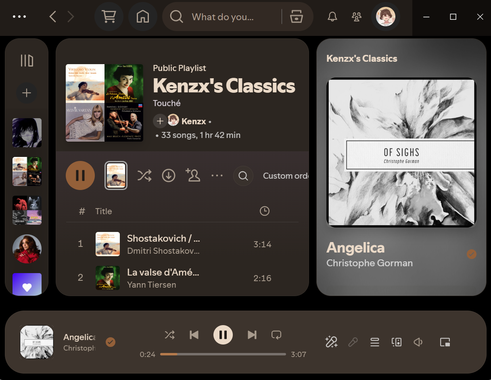

# 🎨 M3 Vibrant

> A vibrant Material 3 Expressive theme for Spotify.

[](https://github.com/spicetify/spicetify-cli)
[](https://opensource.org/licenses/MIT)

A custom [Spicetify](https://github.com/spicetify/spicetify-cli) theme inspired by **Google's Material 3 Expressive** design language. **M3 Vibrant** modernizes Spotify with expressive shapes, refined elevations, adaptive surfaces, smooth interactions, and multiple carefully crafted color schemes.



## ✨ Features

- 📐 **Material 3 Expressive Design** — Organic shapes, adaptive surfaces, and refined spacing inspired by Google's latest design language.
- 🎛️ **Expressive Play Controls** — Custom play button with smooth scaling and morphing hover animations.
- 🎚️ **Floating Volume Slider** — A clean playback bar with a blurred floating volume panel that appears only when needed.
- 👁️ **Improved Light Themes** — Carefully adjusted contrast for comfortable readability.
- 🎨 **14 Color Schemes** — Seven unique aesthetics, each available in Dark and Light variants.

## 🎨 Included Color Schemes

| Theme Style  | Dark Variant    | Light Variant    | Description                        |
| :----------- | :-------------- | :--------------- | :--------------------------------- |
| **GitHub**   | `github-dark`   | `github-light`   | Classic developer-inspired palette |
| **Atom One** | `atom-one-dark` | `atom-one-light` | Popular editor-inspired colors     |
| **Pumpkin**  | `pumpkin-dark`  | `pumpkin-light`  | Warm autumn orange tones           |
| **Rose**     | `rose-dark`     | `rose-light`     | Soft expressive pink palette       |
| **Sepia**    | `sepia-dark`    | `sepia-light`    | Cozy paper-like warm colors        |
| **Green**    | `green-dark`    | `green-light`    | Organic forest and mint greens     |
| **Navy**     | `navy-dark`     | `navy-light`     | Deep premium blue palette          |

## 🚀 Installation

### Prerequisites

Ensure you have [Spicetify CLI](https://github.com/spicetify/spicetify-cli) installed and configured on your system.

### Spicetify Marketplace

### Steps

1. Open **Spicetify Marketplace** from the Spotify sidebar.
2. Navigate to the **Themes** tab.
3. Search for **M3-Vibrant**.
4. Click **Install**.
5. Apply changes (if prompted) or restart Spotify.

### Manual Installation

### Steps

1. **Clone this repository or download it as a ZIP.**

```bash
git clone https://github.com/luoshenshi/M3-Vibrant.git
```

2. **Move the theme folder into your Spicetify Themes directory.**

**Linux / macOS**

```bash
mkdir -p ~/.config/spicetify/Themes/M3-Vibrant

cp -R ./M3-Vibrant/theme/* ~/.config/spicetify/Themes/M3-Vibrant/
```

**Windows (PowerShell)**

```powershell
New-Item -Path "$env:APPDATA\spicetify\Themes\M3-Vibrant" -ItemType Directory -Force

Copy-Item -Path ".\M3-Vibrant\theme\*" -Destination "$env:APPDATA\spicetify\Themes\M3-Vibrant\" -Recurse -Force
```

3. **Apply the theme and choose your preferred color scheme.**

```bash
spicetify config current_theme M3-Vibrant color_scheme rose-dark
spicetify apply
```

## Recommendations

For the best experience with this **THEME**, I recommend using the following snippets and extensions to further enhance its appearance and functionality.

### Snippets

- **Modern ScrollBar** — Optional
- **Spinning CD Cover Art** — Optional
- **Remove Top Gradient** — Optional, but highly recommended

### Extensions

- [**Volume Percentage (Historical)**](https://github.com/ohitstom/spicetify-extensions/tree/main/volumePercentage)

## 🤝 Contributing

Contributions, issues, and feature requests are always welcome!

### Where to Contribute

- 🐛 **Found a bug?** Open an Issue.
- 💡 **Have a feature suggestion?** Create a Feature Request.
- 🛠 **Want to improve the theme?** Submit a Pull Request.

## 📄 License

This project is open source and available under the MIT License.

If you liked M3 Vibrant, consider giving it a star :)
